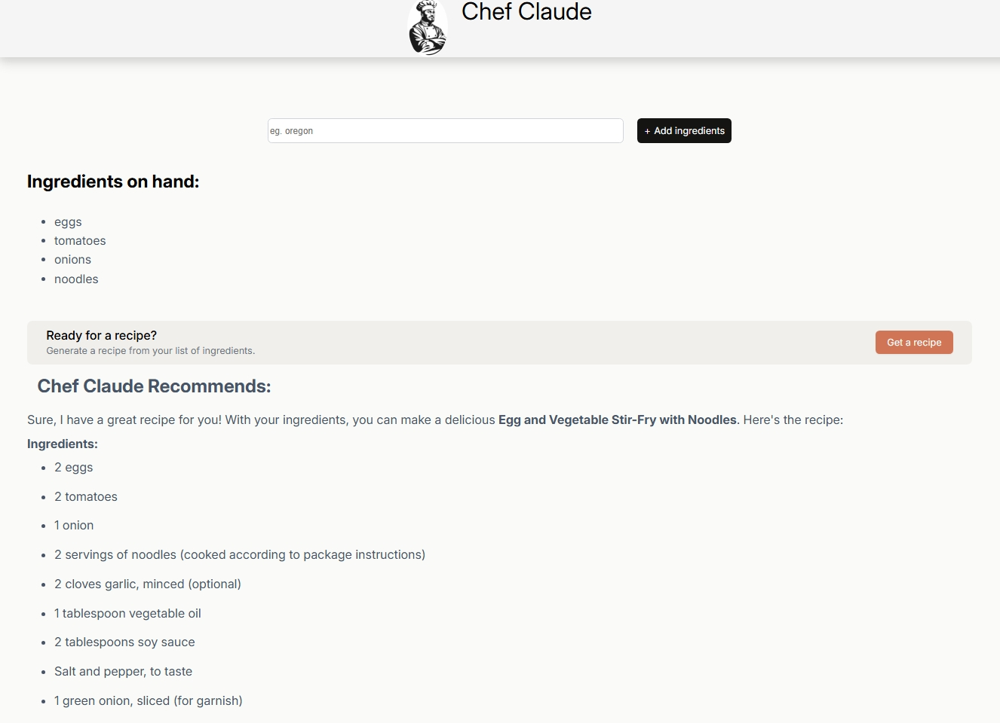
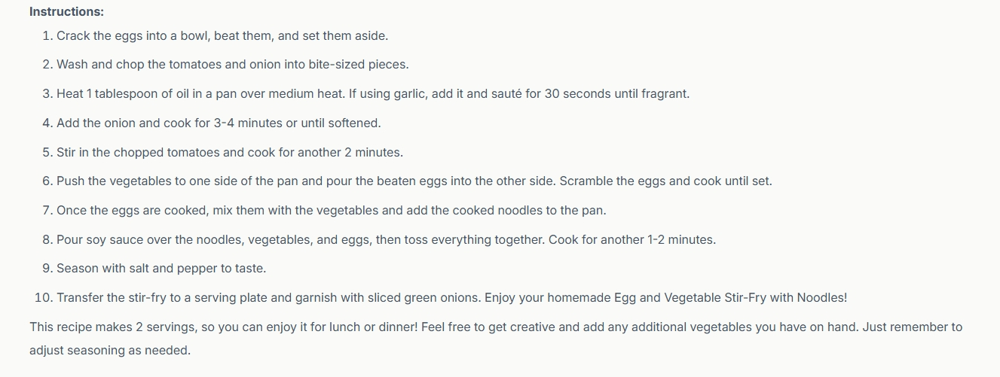

# React + Vite
# 👨‍🍳 Chef Claude – AI-Powered Recipe Recommender

## Table of contents

- [Overview](#overview)
  - [The challenge](#the-challenge)
  - [Screenshot](#screenshot)
  - [Links](#links)
- [My process](#my-process)
  - [Built with](#built-with)
  - [What I learned](#what-i-learned)
  - [Continued development](#continued-development)
  - [Useful resources](#useful-resources)
- [Author](#author)
- [Acknowledgments](#acknowledgments)


## 🧠Overview

- Chef Claude is an AI-powered React web application that generates personalized recipes based on the ingredients users input. It uses Hugging Face's Mixtral-8x7B-Instruct model to create recipes formatted in Markdown for easy reading.

- This project is inspired by Scrimba’s Learn React course by Bob Ziroll and demonstrates practical use of React hooks, conditional rendering, environment variables, form handling, and markdown rendering.

## The challenge

### ✅ Challenge 1: Connecting to the Hugging Face API (HfInference)
❌ Problem:
I were unable to connect because the ```VITE_HF_ACCESS_TOKEN``` was always undefined despite setting it in the ```.env``` file.

🧠 Why it was a challenge:
Vite environment variables must be prefixed with VITE_

The ```.env``` file must be in the project root ```(/my-first-react/.env)```

The file should not be named anything extra, like ```VITE_HF_ACCESS_TOKEN.env```—it should just be ```.env```

### ✅ Resolution:
Make sure the file is exactly: 
``` bash
/my-first-react/.env
```
- With content: ```VITE_HF_ACCESS_TOKEN=your_token_here```

### ✅ Challenge 2: Markdown output from the API (Rendering)
### ❌ Problem:
I couldn’t get react-markdown to install and import properly.

### 🧠 Why it’s a challenge:
There are multiple markdown libraries (e.g., ```marked```, ```markdown-it```, ```react-markdown``) and tutorials often use different ones.

react-markdown needs specific import syntax.

It’s easy to run into version or ESM/CommonJS issues.

### ✅ Resolution:
### I fixed it by:
```bash
npm install react-markdown
```
#### Then: 
```jsx
import ReactMarkdown from 'react-markdown'

function RecipeDisplay({ markdown }) {
  return <ReactMarkdown>{markdown}</ReactMarkdown>
}
```

This avoided using ```dangerouslySetInnerHTML``` and gave I safer, cleaner rendering via a React-native markdown component.

### 🧠 Why this is a real challenge
- Many tutorials still use outdated or wrong syntax (e.g., older versions of react-markdown).

- Some setups might require additional configuration depending on the bundler or React version.

- Unlike ```marked```, ```react-markdown``` does not require ```dangerouslySetInnerHTML``` and that might trip people up.

### ✅ Challenge: Managing Ingredients in State
### ❌ Problem:
I was building a list of ingredients, but each new one had to be tracked properly.

I tried something:
```js
const [ingredients, setIngredients] = useState('')
```

But that would only track one string, not a list, which breaks things when rendering or submitting multiple items.

### 🧠 Why it’s a challenge:
Beginners often default to ```useState('')``` and don’t realize they need an array of ingredients.

Managing dynamic lists (add/remove/clear) requires a good mental model of ```useState```.

✅ Resolution:
I switched to: 
```js
const [ingredients, setIngredients] = useState([])
```
Then added new ingredients with:
```js
setIngredients(prev => [...prev, newIngredient])
```

Now each ingredient gets tracked in an array, and I can render them with ```.map()```.
✅ Challenge solved by switching from a single string state to an array and using array spread for updates.

### ✅Challenge: Preventing Page Reload on Form Submission
### ❌ Problem:
Your page kept reloading when I submitted a form — which wipes state and breaks React behavior.

I used:
```js
<form onSubmit={handleSubmit}>
```

But maybe I didn’t call event.preventDefault() in handleSubmit, or misunderstood Scrimba's action={function} syntax.

🧠 Why it’s a challenge:
It's not clear that Scrimba's ```<form action={handleSubmit}>``` is a custom behavior, not standard HTML.

Default HTML forms submit to the server and cause a page reload.

Beginners often forget ```event.preventDefault()``` or don’t use synthetic form handling.

✅ Resolution:
I used:

```js
<form action={handleSubmit}>
```

And realized that this approach, specific to Scrimba, prevents reloading because ```action``` is treated like a button handler (not the traditional ```action``` attribute in HTML).

✅ Challenge solved by using ```action``` prop instead of onSubmit, avoiding page reloads and preserving React state.

### ✅Challenge: Async Call Not Awaited
### ❌ Problem:
In your ```getRecipe``` function, I made an API call, but didn’t ```await``` it — so it returned a ```Promise```, not the actual data.

I did:
```jsx
const result = getRecipe(ingredients)
```

#### And got errors like:

- ```undefined is not a function```
- Empty recipe display

### 🧠 Why it’s a challenge:
It’s easy to forget ```await``` when writing ```async``` code fast.

If I don’t ```await``, I get a ```Promise``` instead of the actual data.

Errors are vague and misleading, especially in ```JSX``` like:
```jsx
<p>{recipe}</p> // Shows [object Promise] or crashes
```
#### ✅ Resolution:
I changed it to:
```jsx
const response = await getRecipe()
```
✅ Challenge solved by correctly using await to extract real data from a Promise.


## Screenshot





## Links

- [Live site]()
- [Github repo](https://github.com/jeff20501/ChefClaude)

## Built with
### 🚀 Technologies Used
- React: Frontend framework for building the user interface
- ```@huggingface/inference```: Connects to Hugging Face's inference API for LLM interaction
- ```react-markdown``` v8.0.6: Parses and displays markdown-formatted text in the UI
- CSS (vanilla): Custom styling with media queries and hover states
- Vite: React project bundler and development server
- ```.env```: Stores and protects API credentials using environment variables


## What I learned
### 🔧 Technical Skills  Developed
#### ✅ 1. Managing dynamic state with useState
- Problem: I had to allow users to add and remove ingredients dynamically.

What I did: I used React's ```useState``` to maintain an array of ingredients. I wrote functions to update this array without mutating it directly.

What I learned:
- How to manage dynamic lists in React.

- The importance of using functional updates ```(setState(prev => ...))``` for reliability.

#### ✅ 2. Preventing page reload on form submission
- Problem: Your form was reloading the page on submit.

- What I did: Instead of relying on onSubmit and needing to call event.preventDefault(), I used the action={function} approach (common in Scrimba’s style), which naturally avoids a reload.

#### What I learned:

- That browser default behavior reloads the page on ```<form>``` submit.

- Using ```action={() => ...}``` inside your form tag keeps things reactive without a refresh.

#### ⚠️ 3. Async call not awaited
Problem: I called the API but forgot to ```await``` the response, so your data was undefined.

- What I did: I realized the mistake and added ```await``` in front of the API fetch.

#### What I learned:
- How ```async/await``` works.

- Without await, the function doesn’t wait for the API to resolve, which results in empty or undefined values.

### 💻 Tooling and Dependencies
#### ✅ 4. Installing and importing third-party packages (like react-markdown or marked)
Problem: Installing and importing Markdown libraries wasn’t smooth at first.

- What I did: I tried multiple libraries (```react-markdown```, ```marked```), figured out proper installation commands (```npm install react-markdown```, etc.), and resolved import issues.

#### What I learned:

How to properly install and import npm packages.

That React doesn’t render Markdown natively, and that external libraries are needed.

#### ✅ 5. Safely rendering HTML in React
- Problem: I couldn’t display markdown as formatted HTML.

- What I did: Used a markdown parser (like marked) and dangerouslySetInnerHTML.

##### What I learned:

React escapes ```HTML``` by default for security.

I can inject raw HTML using ```dangerouslySetInnerHTML```, but only when necessary and carefully.

### 🤯 Debugging & Troubleshooting Skills
- I faced issues with environment variables (undefined tokens)

- I learned that ```.env``` variables must start with ```VITE_``` in Vite apps (e.g., ```VITE_API_KEY```)

- I also saw the importance of restarting the dev server after changing ```.env``` files.

- I became more comfortable with console logging and reading network/API errors, realizing that many bugs come from:

👉 Misnaming variables

👉 Missing async await

👉 Incorrect environment setup

👉 Typos in JSON keys or endpoint paths

### 💬 Soft Skills
- Patience and Persistence: I pushed through frustrating bugs instead of giving up.

- Problem-solving Mindset: I broke big problems into smaller steps and debugged each one.


## Continued development
#### 💡 Ideas for Continued Development
- 🔁 Replace Hugging Face with Anthropic's Claude via serverless function for faster, CORS-safe responses

- 💾 LocalStorage to persist added ingredients

- 🧠 Autocomplete ingredients via an external ingredient API

- 🖼️ Add recipe image generation using tools like DALL·E or Hugging Face image models

- ⚙️ Pagination / history of generated recipes

## Author
- [Jeff Muna](https://github.com/jeff20501)

## 🙏 Acknowledgments
- [Scrimba](https://scrimba.com/) and Bob Ziroll for teaching modern React fundamentals

- [Hugging](https://huggingface.co/) Face for their open AI APIs

- [react-markdown](https://www.npmjs.com/package/react-markdown) for Markdown parsing

- [React Docs](https://react.dev/) for clear official documentation

This template provides a minimal setup to get React working in Vite with HMR and some ESLint rules.

Currently, two official plugins are available:

- [@vitejs/plugin-react](https://github.com/vitejs/vite-plugin-react/blob/main/packages/plugin-react) uses [Babel](https://babeljs.io/) for Fast Refresh
- [@vitejs/plugin-react-swc](https://github.com/vitejs/vite-plugin-react/blob/main/packages/plugin-react-swc) uses [SWC](https://swc.rs/) for Fast Refresh

## Expanding the ESLint configuration

If I are developing a production application, we recommend using TypeScript with type-aware lint rules enabled. Check out the [TS template](https://github.com/vitejs/vite/tree/main/packages/create-vite/template-react-ts) for information on how to integrate TypeScript and [`typescript-eslint`](https://typescript-eslint.io) in your project.
